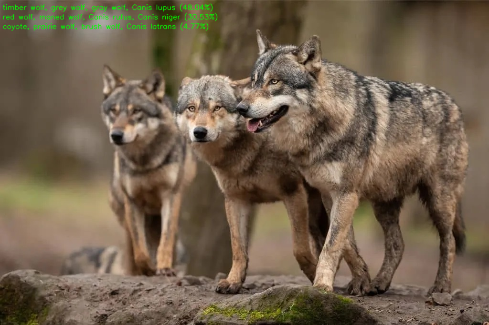

# Classification Demo on Jetson Orin Nano
Load pre-trained [EfficientNet](https://github.com/lukemelas/EfficientNet-PyTorch) model, and make inferences using different engines.



## Startup [Already done]
Preparing environment for running EfficientNet in Jetson-Orin
Requirements are listed below
> pytorch 1.13.0
> torchvision 0.14.1
> pycuda 2024.1
> efficientnet_pytorch 0.7.1
> numpy 1.20.3
> onnx 1.16.0
> tensorrt 8.5.2 (SDK Manager will install it)
> cv2 4.5.4 (SDK Manager will install it)

Installation of Pytorch and Torchvision are from [here](https://forums.developer.nvidia.com/t/pytorch-for-jetson/72048)

**DO NOT USE 'sudo' command**
- Since we build torchvision from source, if you execute startup.sh with sudo, torchvision will be accessible only with sudo command
```shell
sh startup.sh
```


## TODO
- Install required python packages
    ```bash
    $ pip3 install -r requirements.txt
    ```

- Open the jupyter notebook file (`demo.ipynb`), run each cell, see what happens.
- `classification.py` will do the similar thing at once.
    ```bash
    $ python3 classification.py --engine pytorch
    $ python3 classification.py --engine tensorrt_fp32
    $ python3 classification.py --engine tensorrt_fp16
    ```
    - Use `-h` option to see the usage


## What happens in "Classification.py"
- For the given model version (e.g., `b0`) and inference engine type (e.g., `pytorch`), build the EfficientNet model
    - For more details about Efficientnet, please check [this](https://github.com/lukemelas/EfficientNet-PyTorch) out.
    - If you select TensorRT engine, it will automatically build ONNX & TensorRT model from the original PyTorch model (it takes about 10 minutes)

- Then, open the input image and apply preprocessing
    - Resize to 224 x 224
    - Center crop
    - Convert numpy array (np.ndarray) to torch.Tensor
    - Normalize input: substract mean and divide by std. per channel

- Make a prediction for the input image using the model
- Print inference time
- Overlay predictions on image and save it
