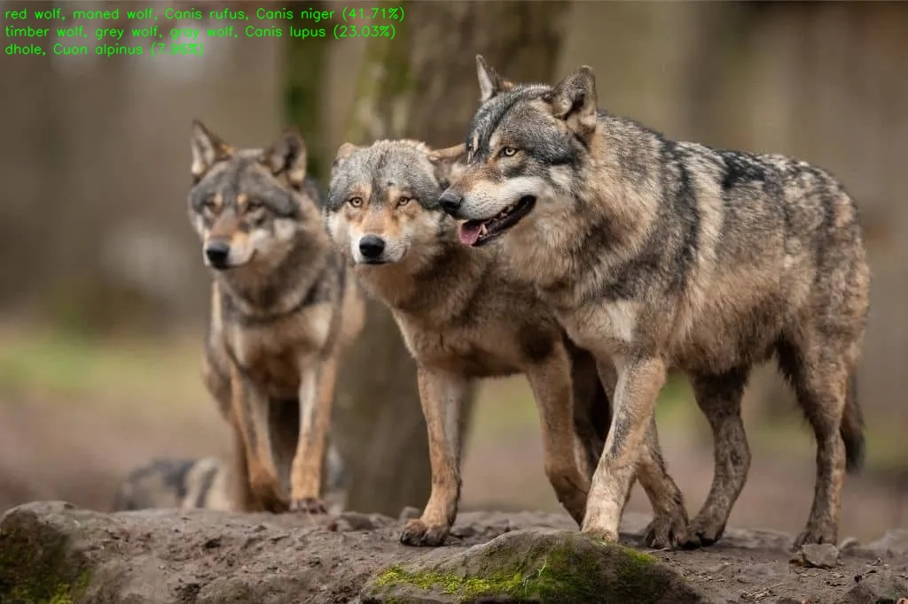

# EfficientNet Demo for Jetson Orin Nano
Classification demo for Jetson-Orin based on [EfficientNet](https://github.com/lukemelas/EfficientNet-PyTorch)


## Startup
Preparing environment for running EfficientNet in Jetson-Orin  
Requirements are listed below
> pytorch 1.13.0  
> torchvision 0.14.1  
> pycuda 2024.1  
> efficientnet_pytorch 0.7.1  
> numpy 1.20.3  
> onnx 1.16.0  
> tensorrt 8.5.2 (SDK Manager will install it)  
> cv2 4.5.4 (SDK Manager will install it)

Installation of Pytorch and Torchvision are from [here](https://forums.developer.nvidia.com/t/pytorch-for-jetson/72048)

**DO NOT USE 'sudo' command**
- Since we build torchvision from source, if you execute startup.sh with sudo, torchvision will be accessible only with sudo command  
```shell  
sh startup.sh 
```
## Demo Setup Description
- You can select EfficientNet b0 to b7, check details in [here](https://github.com/lukemelas/EfficientNet-PyTorch)  
- You can choose model type Original, TensorRT-FP16, TensorRT-FP32
> If you choose TensorRT model, it will automatically build ONNX & TensorRT model (Takes about 10 minutes)
- After build model, select which image to classify
> You can use another images that you want to classify.  
> Just put it in "input_img" directory
- After build model and choose image to classify, EfficientNet will classify your input image among 1000 classes

## RUN
For demonstration just enter below command
```shell
python3 classification.py
```
You have to enter 3 inputs described below

## Inputs
 - **Model Version**: Enter model version of EfficientNet to use (b0~b7)
 - **Model Type**: Enter model type (Original, RT-FP16, RT-FP32)
 - **Input Image**: Enter input image in "input_img" directory

## Results
Classification results of your input image will be saved as **"class_{INPUT_IMG}.jpg"**
